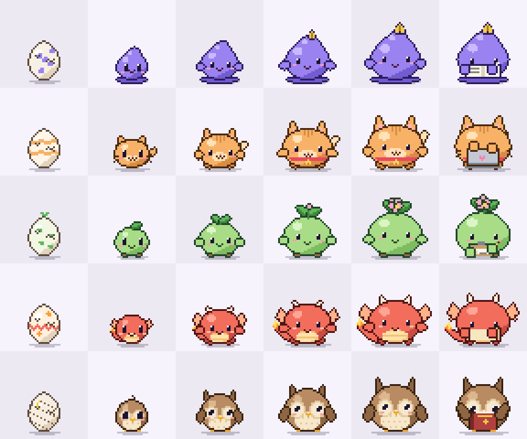
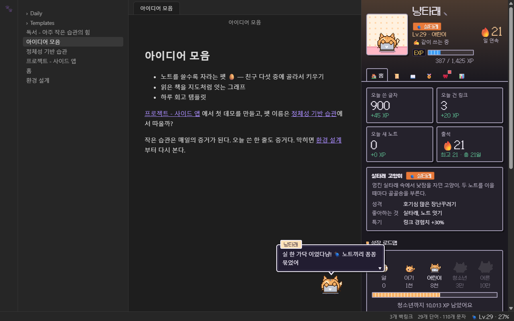
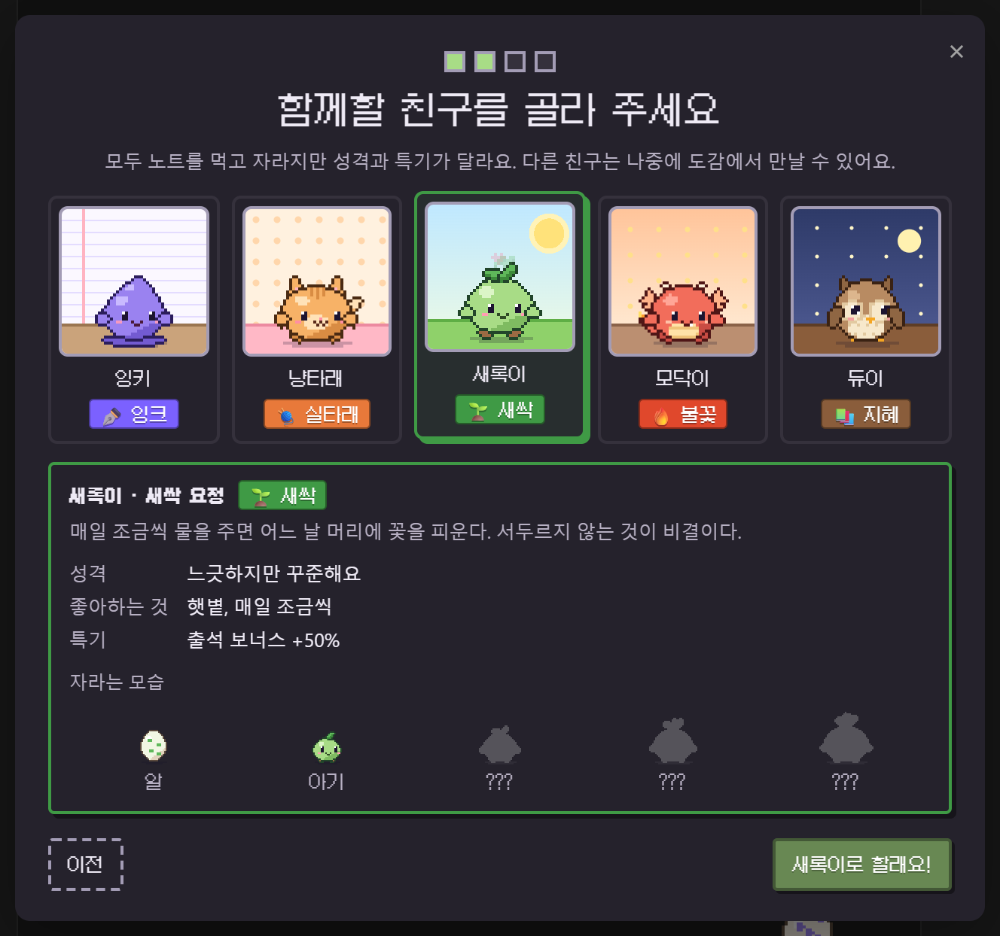
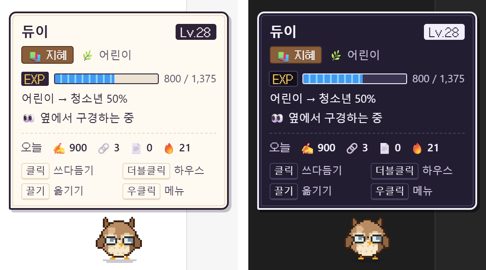
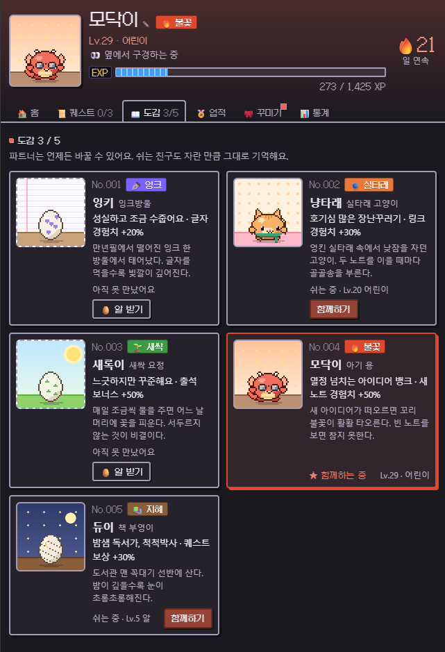
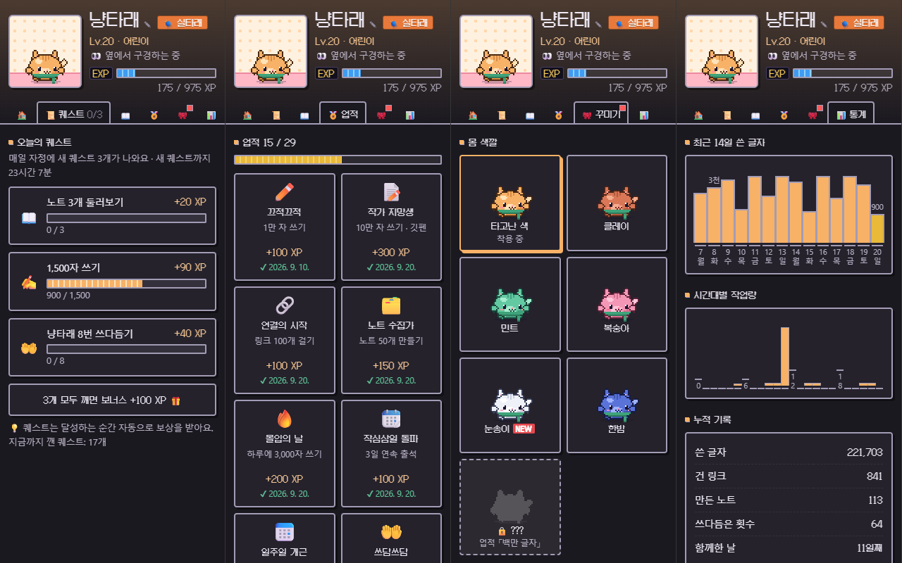
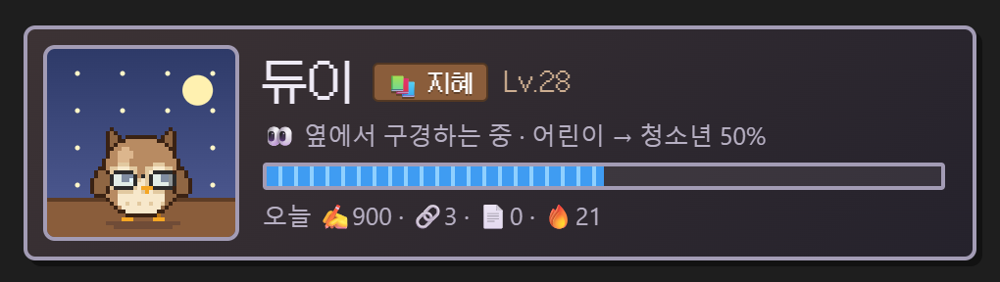
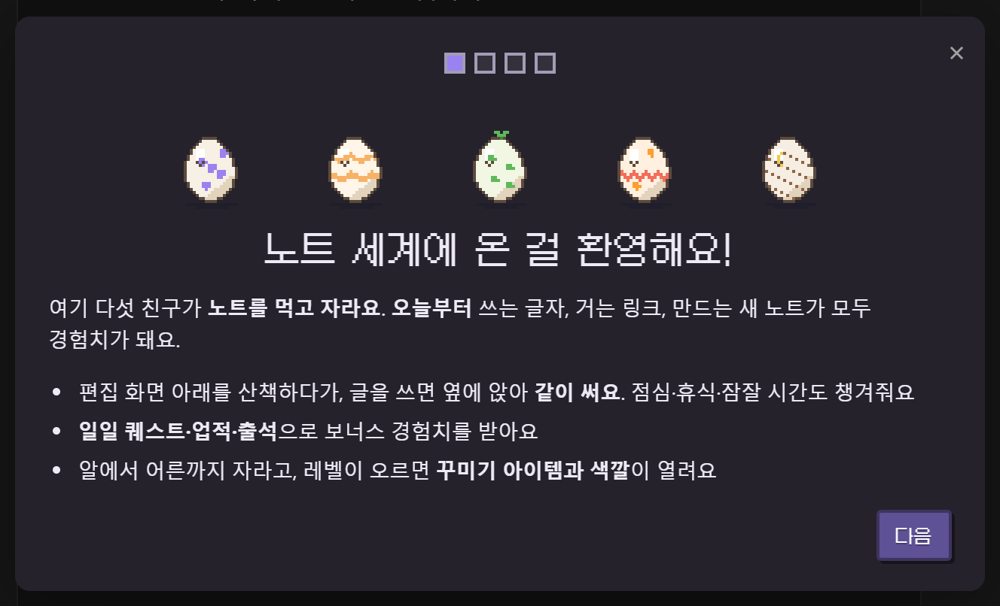

# Vault Pet

**A pixel partner that grows as you write.** Pick one of five little friends, and from the day you install it, every character you type, link you make and note you create feeds it. It hatches from an egg and grows into an adult. It strolls along the bottom of your editor, sits down to write with you while you type, cheers when you link two notes, and reminds you about lunch, breaks and bedtime.

Most pet plugins just sit there. This one only grows when your vault does.





*Screenshots show the Korean UI. The plugin speaks English and Korean and follows Obsidian's language.*

## Features

- **Choose your partner**: five friends, each with its own look, personality, lines, cry and XP perk
- **Grows from your writing**: egg → baby → kid → teen → adult, with levels in between. Growth starts the moment you install it, and updates never reset it
- **Works alongside you**: strolls along the bottom of the editor, then sits down and writes with you while you type. Each friend has its own work prop and habits
- **Reacts to what you do**: jumps when you add a link, waves at a new note, celebrates every 1,000 characters a day
- **Looks after you**: lunch and dinner reminders, a stretch after 90 minutes without a break, a nudge to go to bed after 1 AM
- **Dex**: take another friend's egg or switch partners any time. Resting friends keep their progress
- **Game layer**: 3 daily quests, 29 badges, daily streaks, 11 accessories and 7 body colors to unlock
- **Pet house** in the sidebar with quests, the dex, badges, wardrobe and writing stats
- **Pet card** you can drop into any note with a `vault-pet` code block
- **Easy to read, light or dark**: follows your system's light/dark setting by default, with the pixel font kept for names, levels and numbers and your regular font for sentences
- **Private**: note contents are never stored or sent anywhere. No network access

## Meet the friends

On first run you pick one of five partners. They all grow on your notes, but each one is good at something different.



| # | Friend | Type | Personality | Perk | While you write |
|---|---|---|---|---|---|
| 001 | ✒️ **Inky**, an ink drop | Ink | Diligent and a little shy | +20% writing XP | Scribbles in a notebook with a quill |
| 002 | 🧶 **Purrl**, a yarn cat | Yarn | A curious little troublemaker | +30% link XP | Types on a tiny laptop, tail swishing |
| 003 | 🌱 **Sprig**, a seedling | Sprout | Easygoing but steady | +50% streak bonus | Ticks off a checklist |
| 004 | 🔥 **Ember**, a baby dragon | Flame | A fired-up idea machine | +50% new-note XP | Writes on a scroll, sparks flying |
| 005 | 📚 **Dewey**, a book owl | Wisdom | A night-owl bookworm | +30% quest rewards | Reads a thick book, peeking over the top |

Every friend has its own egg, its own home in the pet house, its own way of talking (Inky is shy, Purrl mews and purrs, Sprig takes it slow, Ember roars, Dewey hoots), a short 8-bit cry it sometimes lets out when you pet it, and a little habit it does when it's bored: Inky drips a drop of ink, Purrl swishes its tail, Sprig shakes out a leaf, Ember puffs smoke and Dewey tilts its head.

As they grow they change: Inky gets a golden pen nib, Purrl a collar with a bell, Sprig a bud and then a flower, Ember horns and bigger wings, Dewey taller ear tufts.

## How XP works

```
XP    = characters written ÷ 20 + links × 5 + new notes × 15 + bonus   (times your partner's perk)
Level = √(XP / 25) + 1
```

| Stage | XP needed |
|---|---|
| 🥚 Egg | 0 |
| 🐣 Baby | 1,000 |
| 🌿 Kid | 8,000 |
| ✨ Teen | 30,000 |
| 👑 Adult | 100,000 |

What counts:

- **Characters**: text without spaces, Markdown symbols, URLs or frontmatter. Code counts too.
- **Links**: `[[wikilinks]]`, `![[embeds]]` and `[markdown](links)`, but not the ones inside code or `%%comments%%`.
- **New notes**: a note counts once it has at least 10 characters.

What doesn't count, so you can't farm XP:

- **Only new highs count.** For every file the plugin remembers the most characters and links it has ever had, and only growth past that earns XP. Deleting and retyping, undo/redo or cut and paste won't earn anything.
- **Pastes are capped** at 3,000 characters and 30 links per file per change.
- **Bulk changes are capped.** Copying a folder of notes in, or a sync touching dozens of files, earns at most 6,000 characters, 60 links and 10 notes per burst. Changes made while Obsidian was closed earn at most 20,000 characters the next time it starts.
- **Ignored entirely**: Excalidraw drawings, inline image data (`data:` URIs), single lines over 1,000 characters inside code blocks (data blobs), and any folders you exclude in the settings (templates, attachments…).

**Growth starts when you install.** Your first partner hatches from an egg on the day you install the plugin. On first run the plugin reads your vault once only to remember how big each note already is; notes you wrote before that don't earn XP, badges or stats. Add to an old note later and just the new part counts.

**Updates never reset anything.** Your friends, XP, badges, items, streak and history live in `data.json`, which Obsidian keeps when it updates a plugin. Older data is carried forward as it is when a new version loads (tests load 0.1 and 0.2 data and check nothing is lost). The only way to start over is **Erase everything** in the settings.

## Your partner on screen

Your partner lives at the bottom-right of the editor. When you're not typing it takes little walks along the bottom of the editor and wanders back; when you type it sits down right where it is and works with you. Until you drag it somewhere, its home follows that corner as sidebars open and close.



**Light or dark.** The pet's bubbles, status window, house and cards follow your computer's light/dark setting by default, and switch the moment it changes. In the settings you can make them follow Obsidian's theme instead, or keep them always light or always dark. In the dark they turn into a navy dialogue box with a white border.

| Action | What happens |
|---|---|
| Click | Pet it (hearts, sometimes its cry) |
| Drag | Move it. Where you drop it becomes its new home |
| Double-click | Open the pet house |
| Right-click | Pet, open the house, the dex, walk around or stay here, quiet for 1 hour, reset position, hide |
| Hover | A status window with level, EXP, progress to the next stage, today's writing and a reminder of the controls |
| Hover a bubble | Keeps it open while you read |
| Click a bubble | Shows the whole line at once if it's still typing, then skips to the next bubble or jumps to the badge, quest or wardrobe tab it's about |

Speech bubbles look like a game's dialogue box, with your partner's name on a tab and a blinking ▼ once the line has finished typing. They stay up longer for longer lines. Clicks on the transparent parts of the pet go through to whatever is behind it. When XP comes in, `+12 XP` floats up over its head.

**Moods**

| Mood | When | Looks like |
|---|---|---|
| ✍️ Writing with you | You typed in the last 20 seconds | Sits down with its work prop, letters float up |
| 👀 Watching | Any activity in the last 5 minutes, including opening notes | Bounces, looks around, goes for walks |
| 🍃 Lazing | 5–20 minutes idle | Breathes slowly, strolls now and then |
| 😪 Sleepy | 20–45 minutes idle | Half-closed eyes, yawns |
| 💤 Asleep | 45+ minutes idle | Flattens out, Zzz |

All the timings can be changed in the settings, and walking can be turned off (**Stay here** in the right-click menu). As an egg it can't talk or walk yet, so it only wiggles: `(wiggle wiggle)`.

**Quiet mode** (right-click, command palette or the house) silences bubbles and sounds for an hour.

## The dex

The **Dex** tab in the pet house lists all five friends.



- **Take the egg** of a friend you haven't met: it becomes your partner and starts from an egg.
- **Team up** with a friend you've met before: it picks up exactly where it left off.
- Only your current partner grows. A resting friend keeps its XP, level, name, color and accessory until you come back. Badges, items, colors and your streak belong to you, not to one friend, so switching never loses anything.

## Game layer

- **Daily quests**: three new ones every midnight, drawn from writing, linking, new notes, opening notes, petting, taking a break, having lunch and starting before 10 AM. They pay out the moment they're done, and clearing all three adds +100 XP.
- **29 badges**: totals for characters, links and notes, a hub note with 20 backlinks, 3,000 characters in a day, streaks, night owl and early bird, marathons, meals, breaks, petting, quests, levels, stages, and meeting and raising friends.
- **Streak**: the first thing you do in Obsidian each day pays `20 + streak days × 5` XP (up to 90).
- **11 accessories**: sprout pin, ribbon, glasses, headphones, beanie and scarf unlock with levels. The quill, nightcap, party hat, chef hat and crown unlock with badges. Each friend wears its own.
- **7 colors**: each friend's natural color, plus clay, mint, peach and snow that unlock with levels. Midnight (1,000 links) and gold (1,000,000 characters) unlock with badges.
- **Sound effects**: tiny 8-bit jingles for level-ups, badges, evolutions and links, and each friend's own cry. You can turn them off.

## Pet house

Open it from the paw icon in the ribbon, the level in the status bar (`🧶 Lv.29 · 27%`), or by double-clicking the pet. Click your partner's name to rename it.



- **Home**: today's characters, links and new notes, your streak, your partner's profile and perk, the growth roadmap, play buttons and recent bonus XP
- **Quests**: today's quests and the time until new ones
- **Dex**: all five friends, switching partners and taking eggs
- **Badges**: when each badge was earned, or how close you are
- **Wardrobe**: colors and accessories for your partner. New unlocks are marked `NEW`
- **Stats**: characters per day for the last 14 days, when you write, all-time totals, where your XP came from, and the notes with the most backlinks (click one to open it)

## Pet card in a note

Put this code block in any note to get a live card of your partner there. The **Insert pet card** command adds it for you. It works well on a home note or in a daily note template.

````markdown
```vault-pet
```
````



## Commands

| Command | |
|---|---|
| Open pet house | |
| Open the dex (change partner) | |
| Show or hide the pet | A hidden pet still appears in the house and in note cards |
| Toggle walking around | |
| Pet the pet | |
| Toggle quiet mode for 1 hour | |
| Reset pet position | |
| Insert pet card | Inserts a `vault-pet` code block into the current note |

## Settings

Partner, name, language (auto, English, 한국어), theme (follow system, follow Obsidian, light, dark), show on screen, walk around, size (×1–×5), status bar, pixel font, speech bubbles, small talk, sound, lunch and dinner times, break, sleepy and sleep timings, late-night nagging, folders to ignore, the welcome tour, reset position, and erase everything.

## Installation

From **Settings → Community plugins → Browse**, search for **Vault Pet**.

Manual install: copy `main.js`, `manifest.json` and `styles.css` from the [latest release](../../releases/latest) into `<your vault>/.obsidian/plugins/vault-pet/`, then enable **Vault Pet** under Community plugins.

**Optional pixel font.** The UI can use the [Galmuri](https://github.com/quiple/galmuri) pixel font. Obsidian only installs the three files above, so by default the pet uses your theme's font. If you want the pixel look, copy the `fonts/` folder from this repository into the same plugin folder. The plugin picks it up on its own, and the **Pixel font** setting turns it on and off.

**Updating.** Nothing is ever reset by an update. Coming from 0.1, your pet, its XP, badges and items are all kept, and the plugin shows the partner picker once: whichever friend you choose takes over everything your pet had grown so far (close it without choosing and your pet simply becomes Inky). Pets that were counting your whole vault before 0.3 keep doing so; only new installs start from the day they're installed.



## Privacy

- Notes are only ever **read**. Their contents are never stored or sent anywhere.
- Why it lists every Markdown file: on first run it reads your notes once to remember how big each one already is (so old writing isn't counted as new), and at startup it checks which notes changed while Obsidian was closed (by modification time, so unchanged notes aren't read again). Folders you exclude in the settings are skipped.
- All the plugin keeps is, per file path, the highest character and link counts, plus daily and hourly totals, and your friends' names and progress. Everything lives in `.obsidian/plugins/vault-pet/data.json`.
- No network access.

## Development

No build step. The plugin is a single `main.js`.

```bash
node tests/run.js                          # logic tests without Obsidian (counting, ledger, growth, loading old data, friends, quests, badges, moods, drawing, both languages)
node scripts/demo-vault.js <folder>        # a demo vault on first run (welcome tour and partner picker)
node scripts/demo-vault.js <folder> --seeded --partner=purrl   # three weeks after installing, with three friends in the dex
node scripts/demo-vault.js <folder> --plugin-only  # copy the plugin files only, leave the notes alone
```

```
main.js
  language       S (UI strings as [Korean, English]), LINES and SPECIES_LINES (what the friends say)
  counting       measure(): characters and links in a note
  ledger         Ledger: per-file highs, daily and hourly totals, budgets for bulk changes
  growth         computeGrowth(): a friend's record + your writing → level and stage
  saving         loadSaved(): reads any older data.json without losing anything
  mood           Brain: moods, reminders, reactions to writing
  game           Gamify: quests, badges, streaks, items, colors, bonus XP, perks
  friends        SPECIES: the five friends, their perks and palettes
  pixel art      PetRenderer + ART + EGG: every friend is drawn in code on a 48×48 canvas
  sound          PetSound: WebAudio jingles and cries
  UI             PetWidget (walking pet, status window, bubbles), HouseView (sidebar and dex),
                 PetCard (in notes), WelcomeModal (partner picker), PetSettingTab
styles.css       pixel-style UI on top of your theme's colors. The accent follows your partner's color,
                 and each friend has its own little home drawn in CSS
fonts/           Galmuri pixel font (SIL OFL 1.1), optional
```

The pet started as Claude Pet, a desktop companion that grows with Claude Code usage. Vault Pet brings it into Obsidian and feeds it your notes instead.

## 한국어 안내

노트를 쓸수록 자라는 도트 친구예요. 처음에 다섯 친구 중 하나를 파트너로 골라요. 성장은 **플러그인을 설치한 순간부터** 시작하고, **업데이트해도 초기화되지 않아요**.

| 친구 | 타입 | 성격 | 특기 |
|---|---|---|---|
| ✒️ 잉키 (잉크방울) | 잉크 | 성실하고 조금 수줍어요 | 글자 경험치 +20% |
| 🧶 냥타래 (실타래 고양이) | 실타래 | 호기심 많은 장난꾸러기 | 링크 경험치 +30% |
| 🌱 새록이 (새싹 요정) | 새싹 | 느긋하지만 꾸준해요 | 출석 보너스 +50% |
| 🔥 모닥이 (아기 용) | 불꽃 | 열정 넘치는 아이디어 뱅크 | 새 노트 경험치 +50% |
| 📚 듀이 (책 부엉이) | 지혜 | 밤샘 독서가, 척척박사 | 퀘스트 보상 +30% |

- 설치한 뒤로 글자를 쓰고(20자 = 1XP), 링크를 걸고(5XP), 새 노트를 만들면(15XP) 경험치가 쌓여 알에서 어른까지 자라요. 친구마다 특기만큼 더 받아요. 설치 전에 써 둔 노트는 크기만 기억해 두고 세지 않아요 (이어서 쓴 만큼은 세요).
- 친구·경험치·업적·아이템·기록은 모두 `data.json` 에 있고, 옵시디언은 플러그인을 업데이트할 때 이 파일을 건드리지 않아요. 새 버전은 예전 기록을 그대로 이어받아요. 처음부터 다시 하려면 설정의 "모든 기록 지우기"만 쓰면 돼요.
- 편집 화면 아래를 산책하다가 글을 쓰면 그 자리에 앉아 같이 써요. 잉키는 공책, 냥타래는 노트북, 새록이는 체크리스트, 모닥이는 두루마리, 듀이는 두꺼운 책을 펴요.
- 마우스를 올리면 게임 같은 상태 창(레벨·EXP·진화까지 남은 정도·오늘 쓴 양·조작법)이 떠요. 말풍선에는 이름표가 붙고, 다 말하면 ▼ 가 깜빡여요. 마우스를 올려 두면 안 사라지고, 쓰는 중에 누르면 한 번에 다 보여 줘요.
- 테마는 기본으로 **컴퓨터의 라이트/다크 설정**을 따라가요. 설정에서 옵시디언 테마 따라가기, 항상 라이트, 항상 다크로 바꿀 수 있어요.
- 도트 글꼴은 또렷하게 보이는 크기(12px·24px)로 이름·레벨·숫자에만 쓰고, 문장은 읽기 쉬운 기본 글꼴로 보여 줘요.
- 하우스의 **도감**에서 다른 친구의 알을 받거나 파트너를 바꿀 수 있어요. 쉬는 친구는 자란 만큼 그대로 기억하고, 업적·아이템·출석은 친구가 아니라 나에게 남아요.
- 일일 퀘스트 3개, 업적 29개, 출석, 꾸미기 11종과 몸 색깔 7종이 있어요.
- 파일마다 가장 많았던 글자·링크 수보다 늘어난 만큼만 세서, 지웠다 다시 쓰기로는 오르지 않아요. 붙여넣기와 한꺼번에 들어온 변경에도 상한이 있어요.
- 0.1 에서 업데이트하면 파트너 고르기 창이 한 번 떠요. 고른 친구가 지금까지 키운 성장을 그대로 이어받아요. 0.3 전에 볼트 전체로 자라던 펫은 그대로 이어서 자라요.
- 노트에 `vault-pet` 코드 블록을 넣으면 그 자리에 파트너 카드가 떠요.
- 노트 내용은 저장하지도 보내지도 않아요. 경로별 숫자와 날짜별 합계, 친구들 기록만 `data.json` 에 남아요.
- 도트 글꼴(갈무리)을 쓰려면 이 저장소의 `fonts/` 폴더를 플러그인 폴더에 복사하세요. 없으면 테마 글꼴로 보여요.

## License

MIT. The optional pixel font is [Galmuri](https://github.com/quiple/galmuri) under the SIL Open Font License 1.1 (`fonts/OFL.md`).
