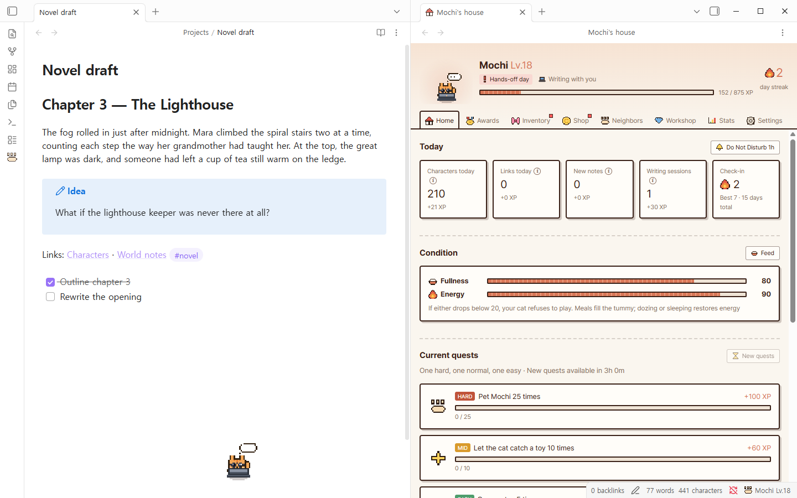
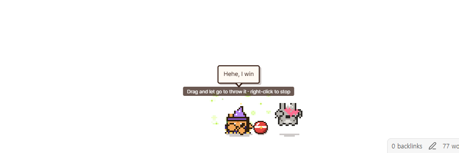
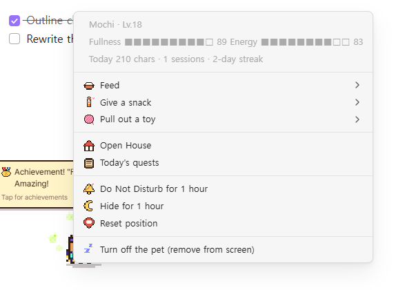
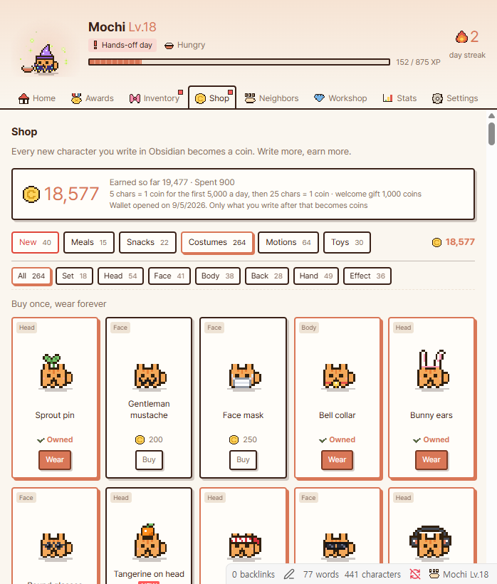
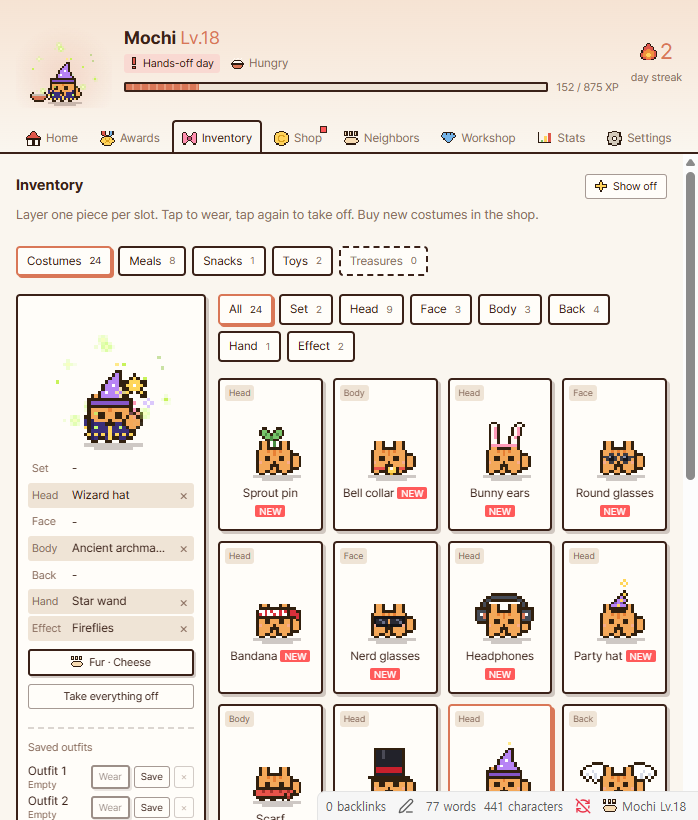
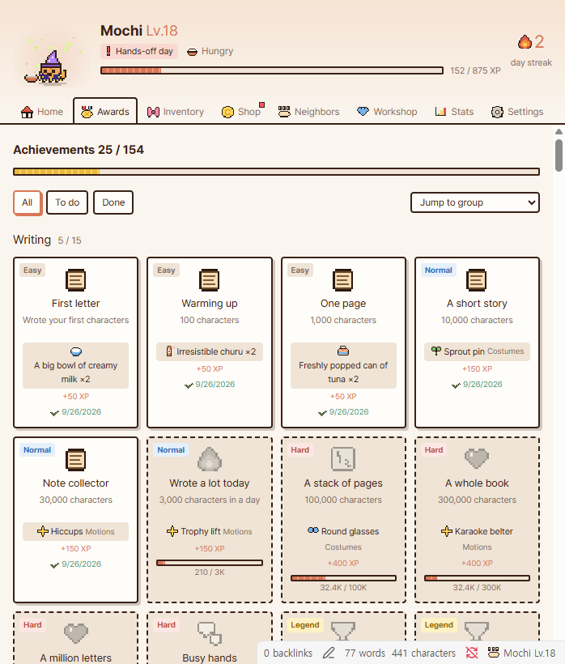
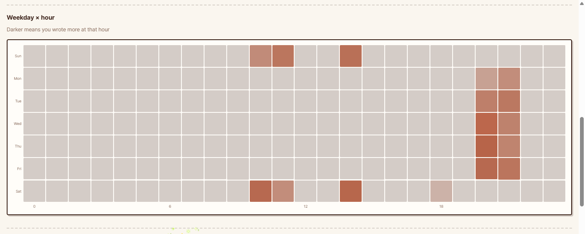
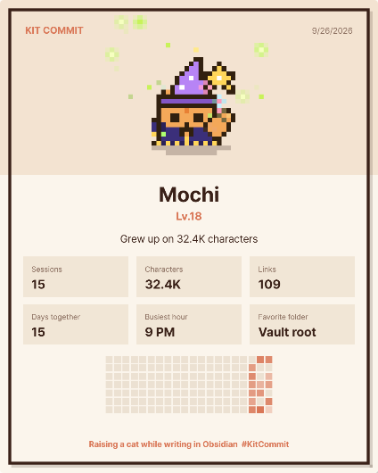

# Kit Commit

**A pixel cat that lives at the bottom of your vault and grows every time you write.**

Kit Commit turns writing into a cozy little game. A hand-drawn pixel cat strolls along the bottom of your workspace, pulls out a tiny laptop and types along with you, and levels up from the words you put into your notes. Every character you write becomes XP and coins. Spend them on costumes, toys and snacks, clear daily quests, collect badges, and watch your cat grow alongside your notes.



## Why you'll love it

- **Writing feels rewarding.** Characters, links, new notes and writing sessions all turn into XP and coins, so every session has a small payoff.
- **It keeps you company.** While you type, your cat types too. Start a new note and leave it blank, and it raises a little `!` and waits for your first line. Write for a while and stop, and it hops with joy.
- **It looks after you.** Lunch and dinner reminders, a stretch break after two hours of writing, and a gentle "go to bed" when it gets too late.
- **There's a lot to collect.** 264 costumes, 64 motions, 30 toys and mini-games, 17 fur colors, 154 badges and a treasure workshop.
- **It's fair.** Only real new writing counts. Deleting and retyping, undo, or pasting in big chunks earns nothing.
- **It's private.** Your notes are only read, never stored or sent anywhere. No network access at all.

## Meet your cat

Your cat lives on the floor of your workspace, just above the status bar. It naps, wanders, chases bugs, grooms itself, and has a mood of the day: some days it's calm, some days it's playful, and some days it really doesn't want to be petted.

| Action | What happens |
|---|---|
| Click | Pet it (hearts). Your cursor stays right where it was in your note |
| Rub side to side | It purrs. On a grumpy day, you might get a paw swat |
| Drag | Pick it up and move it (it dangles, then lands) |
| Double-click | Open the house |
| Right-click | Feed it, give a snack, pull out a toy, quiet mode, hide, reset position |
| Click a speech bubble | Jump straight to the badge, quest or item it's talking about |

Clicks on the empty parts of the floor pass straight through to Obsidian, so your cat never gets in the way.





### Moods

| Mood | When | What it does |
|---|---|---|
| Writing with you | You're typing | Sits behind a laptop and types along, a thought bubble over its head |
| Waiting | A new note has stayed empty | Raises a `!` and waves until you write the first line |
| Watching | You were active in the last 5 minutes | Bounces, looks around, goes for walks |
| Lazing | 5–30 minutes idle | Breathes slowly, stretches, loafs |
| Sleepy | 30–60 minutes idle, or near bedtime | Half-closed eyes, yawns |
| Asleep | An hour or more idle | Curls up into a loaf, Zzz |
| Hungry | Mealtime came and nobody fed it | Stares at an empty bowl, ears down |

## How it grows

```
XP    = characters ÷ 10 + links × 10 + new notes × 20 + writing sessions × 30 + bonuses
Level = √(XP / 25) + 1
```

- **Characters**: new text, not counting spaces, Markdown symbols, URLs or frontmatter. Code counts too.
- **Links**: `[[wikilinks]]`, `![[embeds]]` and `[markdown](links)`.
- **New notes**: each note counts once, after its first 10 characters.
- **Writing sessions**: starting to write again after a break of 30+ minutes.
- **Bonuses**: daily quests, badges and your daily check-in streak.

Growth starts on the day you install. Kit Commit takes one quick look at your vault to remember how long each note already is, so writing you did before doesn't count (the welcome screen shows, just for fun, what level you'd be if it did).

## Coins and the shop

Everything you write fills your wallet. The first 5,000 characters each day earn 1 coin per 5 characters, and after that 1 coin per 25. You also get 1,000 coins as a welcome gift.



| Category | What you get |
|---|---|
| Meals and snacks | Fill your cat's fullness and energy. It walks over and eats them off the floor |
| Costumes | 264 pieces across head, face, body, back, hand, effect and full sets. Layer one per slot, save up to three outfits |
| Motions | 64 moves for any moment: writing, finishing a stretch, leveling up, bedtime, idle time and more |
| Toys | 30 toys and mini-games: balls, yarn, a laser pointer, bubbles, a cat wheel, a slot machine, whack-a-cat, rock-paper-scissors, tug of war, a trampoline… |

New items unlock as you level up, all the way to Lv.80.



## Quests, badges and more

- **Three daily quests** (hard, normal, easy): write characters, add links, fill new notes, open notes, pet your cat, feed it, take a real break… They pay out the moment you finish.
- **154 badges** across writing, links, new notes, sessions, streaks, daily rhythm, bonding, collecting and **using Obsidian**: tags, finished tasks, headings, embeds, callouts, daily notes, canvases and hub notes with lots of backlinks.
- **Neighbor cats** drop by every couple of hours. Trade treasures, share a snack and become best friends, then call them over or gift them costumes.
- **Surprise events**: your cat might dash off screen and come back with a tiny treasure, or chase a bird across your workspace.
- **Treasure workshop**: craft exclusive costumes out of the treasures you find.



## Stats and a card to show off

The Stats tab shows what you've written and the coins it earned, a weekday × hour heatmap of when you write best, your cat's household ledger and where your XP came from. Your cat even reads you a warm line at the top.



Make a show-off card with your cat in its current outfit, your level and your writing stats, then save it to your vault, copy the image or copy a ready-made caption.



## Settings

Open the house (paw icon in the ribbon, your cat's name in the status bar, or double-click the cat) and go to **Settings**:

- Name, size (5 steps), fur color
- **Mute**: turns off every sound effect. Also in Obsidian's plugin settings and the command palette
- Language (English, 한국어). It starts in the language your Obsidian is set to
- Speech bubbles, small talk, occasional Obsidian tips
- Lunch and dinner times, break reminder, when to get sleepy, bedtime, late-night nagging
- Motions for every situation, with a drag-and-drop editor
- Folders that count toward growth (untick a top-level folder to leave it out)
- Show or hide the cat on screen, reset its position, start over

## Commands

Open house · Show today's quests · Open shop · Open wardrobe · Feed · Pet the cat · Toggle sound (mute) · Toggle quiet mode (1 hour) · Show or hide the cat · Hide the cat for 1 hour · Reset cat position · Stop playing

## Installation

**Community plugins:** in Obsidian, open **Settings → Community plugins → Browse**, search for **Kit Commit** and install it.

**Manual:** download `main.js`, `manifest.json` and `styles.css` from the [latest release](../../releases/latest) into `<your vault>/.obsidian/plugins/kit-commit/`, then enable **Kit Commit** under Community plugins.

**Optional font:** for the exact look, also copy the `fonts/` folder (Pretendard, SIL Open Font License) into the same plugin folder. Without it, Kit Commit uses the fonts on your system.

Kit Commit is desktop only, since petting, dragging and right-clicking your cat are a big part of the fun.

## Privacy

- Notes are only **read**. Their contents are never stored, shown elsewhere or sent anywhere. The plugin makes no network requests.
- File and folder paths are never stored as-is. Each part of a path is replaced by a short hash, so your data file can't reveal what's in your vault.
- What is saved: for each note, its longest-ever character and link counts and a few feature counts; hourly writing totals per top-level folder; and your cat. All of it lives in `.obsidian/plugins/kit-commit/data.json`.
- A PNG is only created in your vault when you press **Save image** on the show-off card.

### What Kit Commit accesses, and why

| Access | Why | When |
|---|---|---|
| **List of notes in your vault** | To remember how long each note already is, so writing you did before installing never counts, and to catch up on notes changed while Obsidian was closed | Once on first run, then only notes whose modified time changed. Folders you untick in the settings are skipped |
| **Reading notes** | To count new characters, links, tags, tasks, headings, embeds and callouts | Only when a note changes. Contents are never stored |
| **Clipboard (write only)** | The **Copy image** and **Copy caption** buttons on the show-off card | Only when you press one of them. Kit Commit never reads your clipboard |
| **Plugin data file** | Your cat, wallet, badges and hourly writing totals | `.obsidian/plugins/kit-commit/data.json`. Nothing is kept in browser storage |

## FAQ

**Will old notes level up my cat?** No. Growth starts when you install. Adding to an old note later counts, but only the new part.

**Can I farm XP by pasting text?** Not really. Each note remembers its longest-ever length, so only real growth counts, and big pastes or bulk changes are capped.

**Does it slow Obsidian down?** The cat lives in a lightweight transparent layer that ignores clicks except on the cat itself, and your vault is only read when notes change.

**My cat won't play.** It might be hungry, tired or simply bored of that toy. Feed it, let it nap, or try again in a few minutes.

---

### 한국어

**Kit Commit(킷커밋)** 은 옵시디언에 글을 쓸수록 자라는 도트 고양이예요. 작업 영역 바닥에서 같이 타이핑하고, 쓴 글자·링크·새 노트가 경험치와 코인이 돼요. 코스튬 264개, 모션 64개, 장난감·미니게임 30개, 일일 퀘스트, 업적 154개, 놀러 오는 동네 친구, 보물 공방까지. 노트 내용은 읽기만 하고 어디에도 저장하거나 보내지 않아요. 고양이 언어는 옵시디언 언어 설정을 따라 처음에 정해지고, 하우스 설정에서 바꿀 수 있어요.

---

Kit Commit is the Obsidian edition of the Kit Commit desktop pet. **An unofficial fan-made project**, not affiliated with, made by or endorsed by Anthropic or Obsidian.

MIT License · Pretendard font under the SIL Open Font License 1.1
