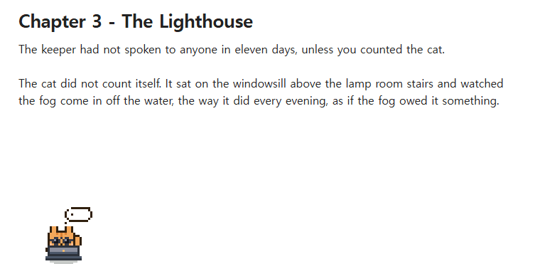
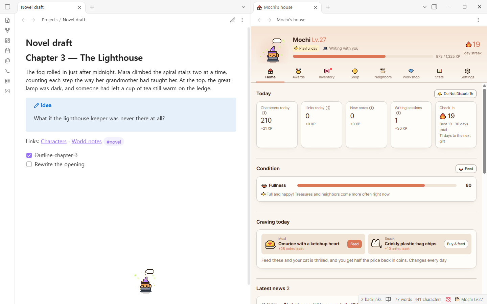
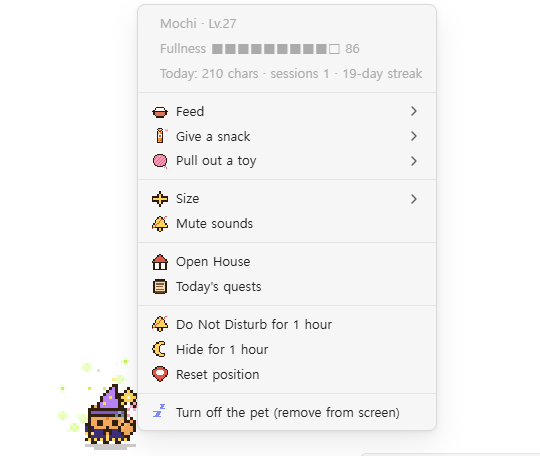
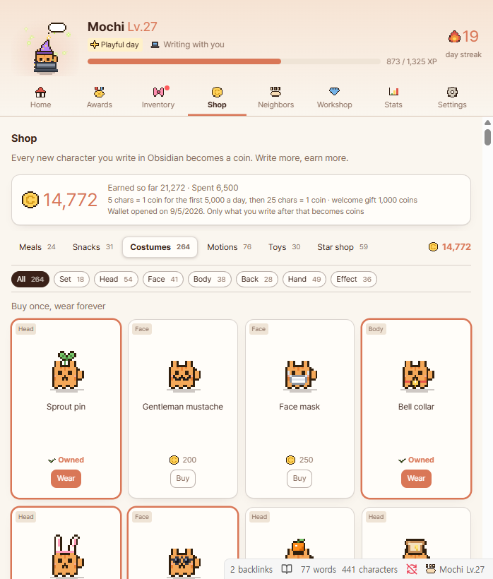
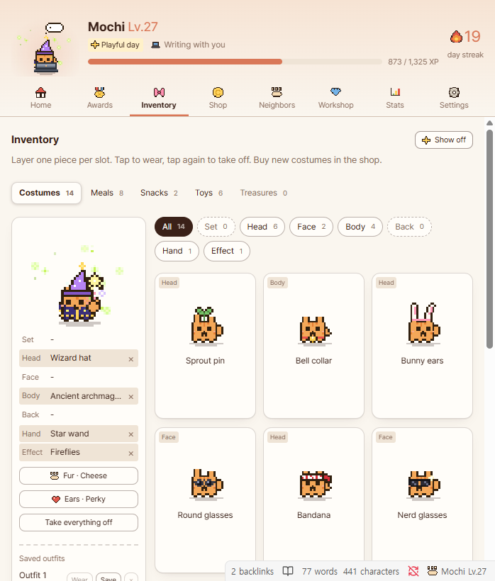
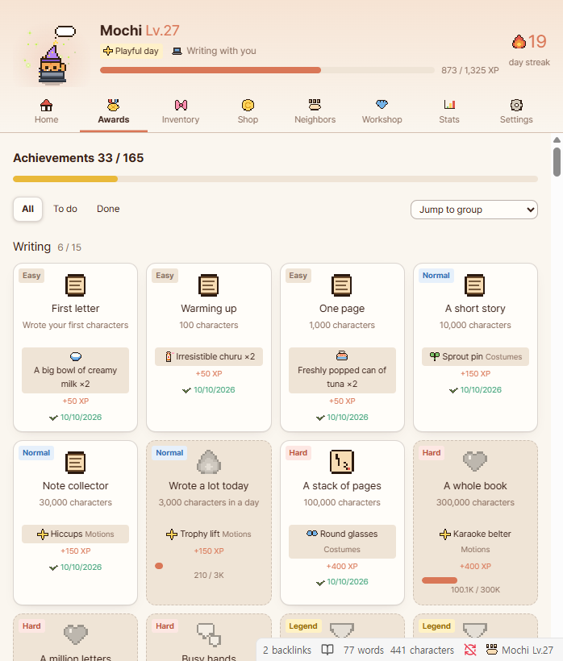
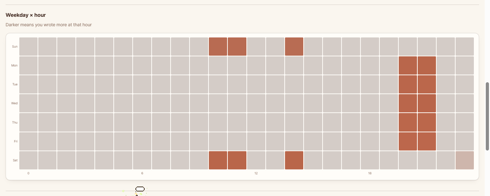
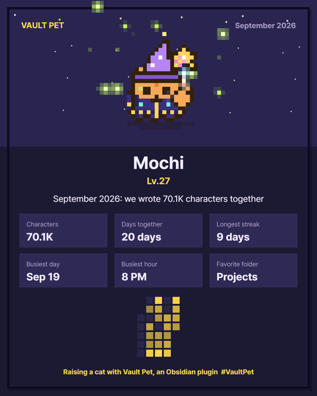

# Vault Pet

**A pixel cat that lives at the bottom of your vault and grows every time you write.**

Vault Pet turns writing into a cozy little game. A hand-drawn pixel cat strolls along the bottom of your workspace, pulls out a tiny laptop and types along with you, and levels up from the words you put into your notes. Every character you write becomes XP and coins. Spend them on costumes, toys and snacks, clear daily quests, collect badges, and watch your cat grow alongside your notes.





## Why you'll love it

- **Writing feels rewarding.** Characters, links, new notes and writing sessions all turn into XP and coins, so every session has a small payoff.
- **It keeps you company.** While you type, your cat types too. Start a new note and leave it blank, and it raises a little `!` and waits for your first line. Write for a while and stop, and it hops with joy.
- **It looks after you.** Lunch and dinner reminders, a stretch break after two hours of writing, and a gentle "go to bed" when it gets too late.
- **It knows when to talk.** Small talk waits for your breaks instead of interrupting a sentence, and it remembers what happened: the late night you wrote until 1 AM, the snack it always gets, the friend who dropped by.
- **There's a lot to collect.** 320 costumes (56 of them endgame star costumes), 76 motions, 30 toys and mini-games, 18 premium dishes, 20 fur colors, 13 ear shapes, 165 badges and a treasure workshop.
- **It never runs out.** Levels stop at Lv.80, and from then on your writing earns stars for a shop of its own.
- **It's fair.** Only real new writing counts. Deleting and retyping, undo, pasting or dragging text in, and restoring a deleted note earn nothing.
- **It's private.** Your notes are only read, never stored or sent anywhere. No network access at all.

## Meet your cat

Your cat lives on the floor of your workspace, just above the status bar. It naps, wanders, chases bugs, grooms itself, and has a mood of the day: some days it's calm, some days it's playful, and some days it really doesn't want to be petted.

| Action | What happens |
|---|---|
| Click | Pet it (hearts). Your cursor stays right where it was in your note |
| Rub side to side | It purrs. On a grumpy day, you might get a paw swat |
| Drag | Pick it up and move it (it dangles, then lands) |
| Double-click | Open the house |
| Right-click | Feed it, give a snack, pull out a toy, quiet mode, hide, reset position |
| Click a speech bubble | Jump straight to the badge, quest or item it's talking about |

Clicks on the empty parts of the floor pass straight through to Obsidian, so your cat never gets in the way.




### Moods

| Mood | When | What it does |
|---|---|---|
| Writing with you | You're typing | Sits behind a laptop and types along, a thought bubble over its head |
| Waiting | A new note has stayed empty | Raises a `!` and waves until you write the first line |
| Watching | You were active in the last 5 minutes | Bounces, looks around, goes for walks |
| Lazing | 5–30 minutes idle | Breathes slowly, stretches, loafs |
| Sleepy | 30–60 minutes idle, or near bedtime | Half-closed eyes, yawns |
| Asleep | An hour or more idle | Curls up into a loaf, Zzz |
| Hungry | Mealtime came and nobody fed it | Stares at an empty bowl, ears down |

## How it grows

```
XP    = characters ÷ 10 + links × 10 + new notes × 20 + writing sessions × 30 + bonuses
Level = √(XP / 25) + 1, up to Lv.80
Stars = after Lv.80, one star for every 2,000 XP (each star also pays 500 coins)
```

- **Characters**: new text, not counting spaces, Markdown symbols, URLs or frontmatter. Code counts too.
- **Links**: `[[wikilinks]]`, `![[embeds]]` and `[markdown](links)`.
- **New notes**: each note counts once, after its first 10 characters.
- **Writing sessions**: starting to write again after a break of 30+ minutes.
- **Bonuses**: daily quests, badges and your daily check-in streak. Long streaks also pay coins at 30, 50, 100, 200 and 365 days.

Growth starts on the day you install. Vault Pet takes one quick look at your vault to remember how long each note already is, so writing you did before doesn't count (the welcome screen shows, just for fun, what level you'd be if it did).

## Coins and the shop

Everything you write fills your wallet. The first 5,000 characters each day earn 1 coin per 5 characters, and after that 1 coin per 25. You also get 1,000 coins as a welcome gift.



| Category | What you get |
|---|---|
| Meals and snacks | Fill your cat's fullness. It walks over and eats them off the floor. A full cat (50+) finds treasures and gets neighbor visits more often, and a hungry one still plays. Every day it craves one meal and one snack: feed those and you get half the price back. Premium dishes do something extra: keep it full for hours, hide a treasure, tell a fortune or invite a friend over |
| Costumes | 264 pieces across head, face, body, back, hand, effect and full sets. Layer one per slot, save up to three outfits |
| Motions | 76 moves for any moment: writing, finishing a stretch, leveling up, bedtime, idle time and more. A motion you buy goes straight into the situation you were browsing |
| Toys | 30 toys and mini-games: balls, yarn, a laser pointer, bubbles, a cat wheel, a slot machine, whack-a-cat, rock-paper-scissors, tug of war, a trampoline… After a long stretch of writing, your cat sometimes brings one over during your break. Click the bubble to play |
| Star shop | 56 endgame costumes (celestial crowns, six-winged angel wings, a cat that becomes the sun…) and 3 animated fur colors (aurora, neon, hologram), bought only with stars |

New items unlock as you level up, all the way to Lv.80. Locked items show a faint preview, so you can see what you're working toward.



## Quests, badges and more

- **Three daily quests** (hard, normal, easy): write characters, add links, fill new notes, open notes, pet your cat, feed it, take a real break… They pay out the moment you finish.
- **Today's news** on the home tab keeps every badge, reward and visit from today, even the ones you missed while in quiet mode. Several badges at once arrive as a single bubble.
- **165 badges** across writing, links, new notes, sessions, streaks, daily rhythm, bonding, collecting and **using Obsidian**: tags, finished tasks, headings, embeds, callouts, daily notes, canvases and hub notes with lots of backlinks.
- **Neighbor cats** drop by every couple of hours. Trade treasures, share a snack and become best friends, then call them over or gift them costumes.
- **Surprise events**: your cat might dash off screen and come back with a tiny treasure, or chase a bird across your workspace.
- **Treasure workshop**: craft exclusive costumes out of the treasures you find. The treasure exchange turns spare treasures into the ones you need, and every crafted costume remembers what it was made from.
- **Once a day, your cat asks you something**: did you eat lunch, when are you going to bed, are you busy today. Say you're busy and it keeps the small talk to itself for two hours.



## Stats and a card to show off

The Stats tab shows what you've written and the coins it earned, a weekday × hour heatmap of when you write best, your cat's household ledger and where your XP came from. Your cat even reads you a warm line at the top.



Make your own show-off card: pick this month, last month or all time, choose up to six stats (characters, links, new notes, sessions, days, longest streak, busiest day, busiest hour, favorite folder, coins, badges, level change, XP, folders), a color, your cat's pose, a one-line caption and a post (4:5) or story (9:16) size. Then save it to your vault, copy the image or copy a ready-made caption. In the first week of each month, the house lets you know last month's card is ready.



Using [Hearth](https://github.com/ondreu/Hearth)? Its **Vault Pet** card puts your cat, or its whole house, on your Hearth dashboard.

## Settings

Open the house (cat face in the ribbon, or double-click the cat; your cat's name in the status bar opens a quick menu) and go to **Settings**:

- Name, size (5 steps), fur color, ear shape (13 shapes, free from the start)
- **Theme** for the house: Cream, Cocoa, Mint milk, Sakura, Milk choco, or Auto (follows your Obsidian light or dark theme)
- **Mute**: turns off every sound effect. Also in Obsidian's plugin settings and the command palette
- Language (English, 한국어). It starts in the language your Obsidian is set to
- Speech bubbles, small talk, occasional Obsidian tips
- Lunch and dinner times, break reminder, when to get sleepy, bedtime, late-night nagging
- Motions for every situation, with a drag-and-drop editor
- Folders that count toward growth (untick a top-level folder to leave it out)
- **Low power mode**: fewer frames and less wandering, to save battery
- Show or hide the cat on screen, reset its position, see what's new again, start over

Obsidian's own plugin settings for Vault Pet have the everyday switches too: show the cat, open the house in the right sidebar instead of a tab, mute, language, reset position and **Send feedback**.

## Commands

Open house · Open house in the right sidebar · Show today's quests · Open shop · Open wardrobe · Feed · Pet the cat · Toggle sound (mute) · Toggle quiet mode (1 hour) · Show or hide the cat · Hide the cat for 1 hour · Reset cat position · Stop playing

## Installation

**Community plugins:** in Obsidian, open **Settings → Community plugins → Browse**, search for **Vault Pet** and install it.

**Manual:** download `main.js`, `manifest.json` and `styles.css` from the [latest release](../../releases/latest) into `<your vault>/.obsidian/plugins/vault-pet/`, then enable **Vault Pet** under Community plugins.

**Optional font:** for the exact look, also copy the `fonts/` folder (Pretendard, SIL Open Font License) into the same plugin folder. Without it, Vault Pet uses the fonts on your system.

Vault Pet is desktop only, since petting, dragging and right-clicking your cat are a big part of the fun.

## Also on your desktop: Kit Commit

Working with Claude Code or Codex too? **[Kit Commit](https://elliott-json-park.github.io/kitcommit-releases/)** is the free desktop edition of the same cat for Windows and Mac. Instead of your writing, it turns your AI token usage into XP and coins: it types along while a reply is being written, claps when it's done and waves when your OK is needed. It never reads your conversations. [Download it here](https://elliott-json-park.github.io/kitcommit-releases/).

## Feedback

Vault Pet has no telemetry, so the only way to know what you like, what's broken and what's missing is if you say so.

- **A bug or a wish:** [open an issue](../../issues/new/choose). One sentence is enough. The **Send feedback** button in the house settings takes you to the same place.
- **Screenshots of your cat, questions, anything else:** [Discussions](../../discussions).

## Privacy

- Notes are only **read**. Their contents are never stored, shown elsewhere or sent anywhere. The plugin makes no network requests.
- File and folder paths are never stored as-is. Each part of a path is replaced by a short hash, so your data file can't reveal what's in your vault.
- What is saved: for each note, its longest-ever character and link counts and a few feature counts (kept for a while after you delete a note, so restoring it doesn't count twice); hourly writing totals per top-level folder; and your cat. All of it lives in `.obsidian/plugins/vault-pet/data.json`.
- A PNG is only created in your vault when you press **Save image** on the show-off card.

### What Vault Pet accesses, and why

| Access | Why | When |
|---|---|---|
| **List of notes in your vault** | To remember how long each note already is, so writing you did before installing never counts, and to catch up on notes changed while Obsidian was closed | Once on first run, then only notes whose modified time changed. Folders you untick in the settings are skipped |
| **Reading notes** | To count new characters, links, tags, tasks, headings, embeds and callouts | Only when a note changes. Contents are never stored |
| **Clipboard (write)** | The **Copy image** and **Copy caption** buttons on the show-off card | Only when you press one of them |
| **Text you paste or drop into a note** | So pasted text doesn't turn into XP and coins | Only at the moment you paste or drop it into a note. Only its length is measured; the text is never stored. Vault Pet never reads your clipboard at any other time |
| **Plugin data file** | Your cat, wallet, badges and hourly writing totals | `.obsidian/plugins/vault-pet/data.json`. Nothing is kept in browser storage |
| **Backup of the data file** | To bring your cat back if `data.json` is ever damaged (a crash mid-save, a sync conflict) | Once a day, a copy is written next to it as `data.backup.json`. A damaged file is kept as `data.broken-<time>.json` rather than deleted |
| **Your browser (link only)** | The **Send feedback** button | Only when you press it. It opens this repository's issue page. Vault Pet itself still makes no network requests |

## FAQ

**Will old notes level up my cat?** No. Growth starts when you install. Adding to an old note later counts, but only the new part.

**Can I farm XP by pasting text?** No. Text you paste or drag into a note doesn't count. Each note also remembers its longest-ever length, even after you delete it, so retyping, restoring a note from the trash or a sync that re-creates files earns nothing. Notes moved in from a folder you left out start from their current size, and bulk changes are capped.

**Does it slow Obsidian down?** The cat lives in a lightweight transparent layer that ignores clicks except on the cat itself, and your vault is only read when notes change.

**My cat disappeared or started over.** If the data file was damaged, Vault Pet restores your cat from the daily backup and tells you so. If that didn't happen, look in `.obsidian/plugins/vault-pet/` for `data.backup.json` and please [open an issue](../../issues/new/choose).

**What happens after Lv.80?** Your level stays at 80, and every 2,000 XP after that becomes a star (plus 500 coins). Stars buy the endgame costumes and animated fur colors in the star shop.

**My cat talks too much.** Small talk waits for a pause in your writing and comes at most once an hour. If you close its chatter within two seconds three times in a row, it stays quiet for three hours. You can also turn small talk or all bubbles off in the settings.

---

### 한국어

**Vault Pet(볼트 펫)** 은 옵시디언에 글을 쓸수록 자라는 도트 고양이예요. 작업 영역 바닥에서 같이 타이핑하고, 쓴 글자·링크·새 노트가 경험치와 코인이 돼요. 코스튬 320개(별로만 사는 끝판왕 코스튬 56개 포함), 모션 76개, 장난감·미니게임 30개, 프리미엄 밥·간식 18가지, 귀 모양 13가지, 일일 퀘스트, 업적 165개, 놀러 오는 동네 친구, 보물 공방과 교환소까지. Lv80 다음에는 별이 쌓이고, 날마다 먹고 싶은 것을 조르고, 기간·칸·색을 골라 나만의 자랑 카드를 만들 수 있어요. 붙여 넣은 글이나 지웠다 되살린 노트는 세지 않고, 노트 내용은 읽기만 할 뿐 어디에도 저장하거나 보내지 않아요. 고양이 언어는 옵시디언 언어 설정을 따라 처음에 정해지고, 하우스 설정에서 바꿀 수 있어요.

Claude Code·Codex 로 일한다면, AI 토큰 사용량을 코인으로 바꿔 주는 데스크톱판 **[킷커밋(Kit Commit)](https://elliott-json-park.github.io/kitcommit-releases/ko/)** 도 무료로 받을 수 있어요 (윈도우·맥).

---

Vault Pet is the Obsidian edition of the [Kit Commit](https://elliott-json-park.github.io/kitcommit-releases/) desktop pet. **An unofficial fan-made project**, not affiliated with, made by or endorsed by Anthropic or Obsidian.

MIT License · Pretendard font under the SIL Open Font License 1.1
